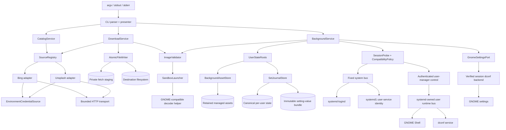

## Context

This is a new command-line application with independently failing boundaries: Bing and Unsplash, the local filesystem, untrusted image decoding, and the current user's GNOME session. There is no existing command or file format to preserve. See `proposal.md` for motivation and the three delta specs for required behavior.

The process runs as the desktop user without elevated privileges or a daemon. Fetched wallpapers are durable user data. Private fetch staging, immutable managed background snapshots, and a pending `set` journal are operational state used for safe publication and recovery; they are not a provider catalog, cache, or history. GNOME receives an application-owned snapshot of the bytes validated by `set`, so replacing the source pathname later cannot change what GNOME reads.

GNOME settings are shared with actors outside this CLI. The application can serialize its own work, but it cannot lock all settings writers. It therefore never reclaims finalized managed assets automatically. An explicit, warned cleanup mode lets the user reclaim old managed copies after a fresh settings check; that operator-directed mode cannot provide concurrent-writer isolation and is kept separate from normal `set`.

## Goals / Non-Goals

**Goals:**

- Keep parsing, provider HTTP behavior, file publication, image decoding, session checks, and GNOME settings behind separate testable boundaries.
- Make a `source` and `key` printed by `browse` sufficient for a later `fetch` process.
- Publish only complete, decoded images and make a retry recognize an identical already-published fetch.
- Prove that settings operations and GNOME Shell share a supported, active local Ubuntu GNOME session before changing settings.
- Recover journaled GNOME writes after ordinary errors, process exit, Shell restart, logout, or reboot by rebinding the recorded stable settings target to a newly verified session.
- Give each failure one owner, an actionable message, and a stable exit-status category.

**Non-Goals:**

- A graphical interface, background rotation, scheduling, search, or source ranking.
- A provider-result catalog, cache, history, or account store.
- Support for a desktop stack outside the package's explicit Ubuntu GNOME compatibility manifest.
- Editing, resizing, converting, or otherwise transforming images.
- Automatically deleting finalized managed background assets during normal `set` or recovery; reclamation is an explicit, warned maintenance action because external settings writers do not share the CLI lock.
- Managing user source files or fetched destinations after completion.
- Automatically setting an image as part of `fetch`; `fetch` and `set` remain separate commands.

## Component Diagram

`CatalogService` owns browsing. `DownloadService` routes a fetch, validates received bytes, and asks `AtomicFileWriter` to publish them. `BackgroundService` owns durable state-root creation, stable image snapshots, session and compatibility preflight, recovery, render verification, and settings changes. The CLI alone writes output and maps domain errors to statuses; lower layers neither print nor terminate the process.

Provider adapters isolate source-specific requests, redirects, parsing, fetch keys, and the exact origins that receive credentials. `EnvironmentCredentialSource` is the only credential input and never persists values. `SandboxLauncher` is the only path to image decoders. `UserStateRoots` creates, validates, and durability-syncs application directory trees before they are relied on. `SessionProbe` combines logind session facts with systemd1 unit facts from the fixed system bus, authenticates the exact user manager through its private control socket, and accepts only the runtime bus owner reported by that manager. It then authenticates the Shell and dconf service owners against manifest-pinned activation and process identities before using their replies. `GnomeSettingsPort` is constructed from that verified desktop boundary and uses only its authenticated dconf backend and trusted system schemas. `BackgroundAssetStore` ensures settings refer to immutable validated bytes, reclaims abandoned temporary files, reports retained-storage statistics, and performs finalized-asset reclamation only through the explicit cleanup mode. `SetJournalStore` durably records bounded transition metadata and owns the separate immutable typed value bundle needed to restore schema-valid settings without a JSON string-length policy. Every boundary is injected so tests can replace external effects.

## Decisions

### 1. Use a thin CLI over application services and injected ports

The executable supports:

- `browse <source>`
- `fetch <source> <key> --output <path>`
- `set <path>`
- `set --recover [--accept-current]`
- `set --cleanup-managed [--yes]`

`source` accepts only `bing` or `unsplash`, case-insensitively. The recovery form is part of `set`, inspects or completes a pending transaction, and does not accept an image path. `--accept-current` is the explicit repair action described in Decision 7. Managed cleanup is also a `set` maintenance form: without `--yes` it only reports candidates and reclaimed-byte estimates; with `--yes` it performs the warned deletion protocol in Decision 5. Main and command help list these inputs, options, effects, and recovery or cleanup warnings.

Parsing produces an application request before network, file, or desktop work. Successful data and help go to standard output; diagnostics go to standard error. Provider, HTTP, filesystem, sandbox, session, asset, journal, and settings ports are injected for deterministic tests.

Alternative considered: perform all effects directly in command handlers. That initially uses fewer types, but duplicates routing and cleanup and makes crash-boundary tests depend on real providers and desktops.

### 2. Normalize providers behind a bounded source adapter contract

The registry contains one adapter per `Source`. Each implements `browse() -> list<WallpaperChoice>` and `open(key) -> ImageStream`. An adapter owns request construction, provider redirects, response parsing, and normalization.

The shared transport requires HTTPS, finite connect/read/total timeouts, and a bounded redirect count. Every connection uses the TLS library's full certificate-chain and DNS-hostname verification, including SNI and subject-alternative-name matching, before any HTTP request bytes or credentials are sent. TLS versions below 1.2, invalid or expired chains, hostname mismatches, and verification warnings are fatal. Trust comes only from the package's fixed Ubuntu system CA bundle path after that file and its parent path have been opened no-follow and verified root-owned and not group/other writable; the TLS trust store is loaded from the retained verified descriptor, not by reopening the pathname. The transport makes direct connections and ignores caller proxy, `SSL_CERT_FILE`, `SSL_CERT_DIR`, `CURL_CA_BUNDLE`, client-certificate, cipher, and TLS-debug inputs; adapters cannot disable verification or add trust anchors. Tests receive an injected transport/trust port rather than changing production TLS policy.

Before connecting, the HTTP parser is configured to accept at most 100 response-header fields, 64 KiB of response headers in aggregate, and 8 KiB for any one field line. These limits apply to every response in a redirect chain; crossing one aborts before body processing. A redirect target must remain HTTPS and belong to the adapter's declared provider or image-delivery host set, and redirect URIs with user information are rejected. Every redirect is independently authenticated under the same certificate, hostname, and fixed-trust policy before request bytes are sent. Image requests advertise `Accept-Encoding: identity`; image responses with a `Content-Encoding` other than absent or `identity` are rejected before body decoding. Their raw transfer body is capped at 50 MiB, so the unsandboxed HTTP path never expands compressed image content. Browse bodies are capped at 2 MiB both on the wire and after content decoding and at 100 records; the streaming parser also caps nesting at 32 and any scalar or token at 8 KiB. Crossing a bound aborts without returning a partial list. Errors never expose provider headers, bodies, or request secrets.

`EnvironmentCredentialSource` reads one provider-specific variable once, immediately after parsing and before any HTTP connection: `WALLPAPER_CLI_BING_API_KEY` for Bing and `WALLPAPER_CLI_UNSPLASH_ACCESS_KEY` for Unsplash. Command help names the applicable variable. A value must be present, non-empty, at most 4 KiB, and contain no NUL, CR, or LF. Missing or invalid credentials produce a source error with status `3` naming the provider and variable but not its value. Credentials exist only in invocation memory, are never accepted as command-line arguments, and are never written to a fetch key, file, journal, diagnostic, or child environment. The credential source returns a redacted credential handle to the adapter, which may attach it only to the manifest-declared API origin and header name. Tests inject a fake credential source rather than changing the real process environment.

Each redirect request is rebuilt, and credentials are looked up by exact HTTPS origin. Crossing origins drops `Authorization`, `Cookie`, `Proxy-Authorization`, `Referer`, adapter secret headers, and body-derived authentication. An allowed delivery host receives only its own origin credential or a signed URL; same-origin redirects retain only adapter-approved headers.

A fetch key is an opaque, versioned, URL-safe adapter token containing `source`, the provider's immutable choice ID, expiry when the provider defines one, and SHA-256 of the adapter's canonical browse record. It never contains an origin, path, query, or redirect target. The canonical record covers the source, choice ID, provider revision or delivery capability, and every field used to select the image. On fetch, the matching adapter validates the token shape and source, performs a fixed-template lookup by the strictly parsed provider ID, canonicalizes the returned record, and requires the digest to match before it follows the record's adapter-validated delivery capability. The fixed lookup origin, path template, and query names are code constants; token bytes cannot alter them. An adapter that cannot re-resolve a choice by such an ID does not expose that result from `browse`.

This binding makes modification or substitution fail closed and prevents a token from steering a credentialed request to another path on an allowed origin. It does not claim that a public choice ID is secret. Using a key with another source is invalid input. A missing, changed, or expired provider record is a source failure and does not publish a file.

Alternative considered: raw provider URLs risk creating an arbitrary downloader, while a key cache adds persistence and cleanup. A fixed provider-ID lookup plus a digest-bound canonical record avoids both and does not rely on a client-side signing secret that the same desktop user could extract. Applying body limits only after headers was rejected because an allowed but faulty endpoint could exhaust the unsandboxed client during header parsing.

### 3. Coordinate fetch staging, publish atomically, and recognize safe replay

The output path is normalized to an absolute path. Its parent must exist and be writable. The writer opens that parent with a no-follow directory descriptor and creates or reuses a marked `.wallpaper-cli-staging` directory that is current-UID-owned and mode `0700`. A destination inside staging is invalid.

Every fetch invocation performs startup reclamation before network access, and every writer and reclaimer uses this acquisition protocol:

1. Take an exclusive advisory lock on the validated mode-`0600` coordination file in staging.
2. While holding it, scan only exact application temporary names. Delete a current-UID-owned, one-link regular temporary only after acquiring its file lock non-blockingly; a locked file belongs to a live writer and is skipped. Sync staging after any deletion.
3. Still holding the coordination lock, create the invocation's random mode-`0600` regular temporary and acquire an exclusive lock on its descriptor before releasing the coordination lock. Retain the temporary lock until rename or unlink.

No temporary has an unlocked creation window. Every automatic fetch, asset-temporary, journal-temporary, and orphan-value-bundle reclamation pass examines at most 256 entries, deletes at most 64 objects, uses only nonblocking lock acquisition, and stops scheduling calls once a 50 ms monotonic cooperative deadline is reached. Reaching an entry, deletion, or cooperative-time bound, or failing scan, lock, unlink, or sync, returns status `4` before new work. A filesystem metadata, directory-read, unlink, or `fsync` call already in progress may outlast 50 ms; the design does not claim a hard wall-clock deadline over kernel or remote-filesystem latency. The count bounds cap the work the application initiates, and the HTTP and sandbox paths retain separate enforceable timeouts. This fail-before-work rule does not govern the explicit finalized-asset cleanup command in Decision 5, whose batch-completion semantics are separate. Fetch holds the short coordination lock only for reclamation and temporary creation, not network transfer.

The service streams the response into its temporary, rejecting non-success, empty, oversized, or invalid image content. After full sandboxed decode it `fsync`s the file and publishes with descriptor-relative `renameat2(RENAME_NOREPLACE)`. It then `fsync`s the destination parent and staging directory because the rename added one entry and removed another.

An existing destination is never overwritten. Replay requires a no-follow, current-UID-owned regular-file descriptor and a Linux read lease, whose acquisition fails when a writer is open. Under the lease, the writer matches size and SHA-256, rechecks name/inode/metadata, syncs the file and directory, removes and syncs its temporary, and flushes success output. A lease-break notification, unavailable lease, mismatch, or unsafe entry returns status `4` untouched. The success linearization point is the final name/identity check while the lease excludes in-place writers.

Before rename, failure removes only the invocation's locked temporary and syncs staging when removal changed it. After rename, a sync failure returns status `4`, names the visible path, and warns that durability was not confirmed; it never deletes the destination. A later identical retry performs startup reclamation, comparison, and the sync sequence before claiming success.

Alternative considered: direct streaming exposes partial files, and `O_TMPFILE` publication is not available to every unprivileged user. Private staging plus no-replace rename works without elevation. Unleased digest comparison was rejected because an in-place writer can race it.

### 4. Decode untrusted images only in a fail-closed sandbox

`ImageValidator` receives an already-open read-only descriptor and fully decodes content; extensions and media types are not evidence. Remote input retains the 50 MiB cap. A local file supplied to `set` has no application policy cap on encoded bytes, dimensions, or decoded pixels, so a readable valid image is not rejected merely for crossing a fixed wallpaper threshold. Machine resource exhaustion remains a local failure.

A static helper runs through `bwrap` with new user, mount, PID, IPC, UTS, cgroup, and network namespaces; an empty environment and root; only the helper, required read-only loader libraries, and one image descriptor; closed extra descriptors; dropped capabilities; `no_new_privs`; and a measured seccomp allowlist that denies networking, mount, ptrace, process creation, and arbitrary path opens. CPU, memory, process, and parent wall-time limits bound exhaustion; timeout kills and reaps the helper.

For ordinary decode, the launcher exposes the descriptor at one fixed read-only in-sandbox path. For a URI render proof, the parent first resolves the percent-decoded managed `file://` URI descriptor-relatively and no-follow, verifies that the open descriptor has the expected owner, type, size, inode identity, and SHA-256, and read-only bind-mounts that descriptor at `/run/wallpaper-cli/input.<suffix>`. The sandbox renderer receives only the corresponding rewritten internal `file:///run/wallpaper-cli/input.<suffix>` URI. No managed directory or caller path is mounted, and arbitrary opens remain denied. After the helper exits, the parent re-resolves the external managed URI and requires the same entry identity and digest. Final settings verification separately requires that GNOME still stores the original external URI. Thus URI parsing/rendering exercises the matched GNOME-compatible bundle on exactly the bytes named by the setting without giving the sandbox general path access.

For `fetch`, the helper fully decodes the content. For `set`, it also uses the decoder/render bundle selected by the matched compatibility tuple and renders the effective `picture-options` into an off-screen surface for current monitor geometry. Its bounded result states detected format, dimensions, bundle identity, internal URI, and whether it produced a non-empty surface. The render probe runs on the stable asset temporary before mutation and through the confined URI mechanism on the final managed asset before commit.

Missing containment, helper failure, timeout, malformed output, bundle mismatch, descriptor/path identity mismatch, or decode failure closes the operation. Invalid downloaded content is status `3`; local validation or sandbox runtime failure is status `4`; a final GNOME render verification failure is status `6`.

Alternative considered: decoding in the CLI or an ordinary child gives hostile parser code desktop-user authority. Generic decode alone cannot prove the supported GNOME stack can render the URI. Mounting the asset directory would allow unnecessary path access, while an exact descriptor-backed bind exposes only the already verified object. Fixed local image limits would narrow the approved valid-readable-image case.

### 5. Give GNOME a stable managed asset and durably create its roots

The asset root is `<passwd-home>/.local/share/wallpaper-cli/backgrounds`, with the home obtained from `getpwuid(geteuid())`, never an environment variable. `UserStateRoots` opens the home no-follow and walks `.local`, `share`, `wallpaper-cli`, and `backgrounds` one component at a time. For every component, whether newly created or already present, it validates the opened entry, `fsync`s that directory, and `fsync`s its already-open parent before proceeding. A retry after an earlier parent-sync failure therefore repairs the uncertain parent entry instead of trusting existence alone. Existing components must be current-UID-owned directories with no group or other write bits; application-owned directories are mode `0700`. A create, validation, or sync failure returns status `4` before asset publication, journal publication, or GNOME mutation. The same walk-and-sync protocol creates and repairs the state hierarchy in Decision 7.

Application-owned directory, staging, journal, and managed-asset operations are no-follow and descriptor-relative; finalized assets are mode-`0400` regular files. The user-supplied `set` path is the deliberate exception: while holding the canonical per-UID `set` lock, the store opens it once with ordinary symlink resolution using `O_RDONLY|O_CLOEXEC`, then requires the resolved descriptor to be a readable regular file. A readable symlink to a regular image is therefore accepted; a dangling link or a link resolving to a directory or unreadable object fails as a local path error. All validation and copying use that one descriptor, so later replacement of any pathname or symlink cannot change the bytes being set. The store copies the descriptor to an exclusive temporary in `.staging`, computes SHA-256, and syncs it. The sandbox decodes and render-probes the completed temporary. The store publishes without replacement as `<sha256>.<safe-detected-suffix>` and syncs both the asset root and `.staging` because publication adds one directory entry and removes another. Before reuse, an existing content-addressed asset must pass owner, type, mode, size, digest, full-decode, and render checks. Settings use only its percent-encoded `file://` URI.

Asset temporaries live in a mode-`0700` `.staging` child, so finalized assets never enlarge the scan. Under the `set` lock, the shared bounded pass deletes only exact-name, current-UID-owned, one-link regular files it can lock non-blockingly, then syncs `.staging`. Temporaries are locked from creation, so live writers are skipped.

Finalized content-addressed assets are retained by normal `set`, rollback, and recovery. After each successful set, the store counts finalized entries and bytes with a bounded scan. At 256 assets or 512 MiB it prints a non-fatal storage warning on standard error with the asset-root path and the `set --cleanup-managed` command; the warning does not change the successful command's status and there is no quota that can reject an otherwise valid readable image.

`set --cleanup-managed` is the supported reclamation path. It takes the canonical `set` lock, refuses to run while a pending transaction or repair intent exists, verifies a supported desktop boundary, and obtains fresh bound-client values for every URI key. It considers only no-follow, current-UID-owned, mode-`0400`, one-link regular files whose exact managed names and digests validate and which are not named by the current settings snapshot. Each invocation examines at most 256 finalized entries, selects at most 64 candidates, uses nonblocking lock acquisition, and stops scheduling scan or deletion calls after a 50 ms monotonic cooperative deadline, checking before and after each metadata, digest, settings-read, or unlink call. An individual filesystem or settings call can exceed that deadline; entry and candidate counts, rather than wall time, are the hard work bounds. It always starts a fresh descriptor-relative scan; this is a deliberate batch, not the automatic-reclamation precondition in Decision 3.

The default dry run reports the current batch's candidates and bytes plus `complete: true` only when end-of-directory was reached before all three scheduling bounds; hitting the 256-entry, 64-candidate, or cooperative 50 ms bound reports `complete: false` and says that confirmation or later reruns expose further batches. It exits `0` after fully flushing that bounded report. `--yes` warns that another settings writer can race the check, then immediately re-reads all URI keys before each unlink. It stops before starting another candidate when the same cooperative deadline has expired. After the selected batch is deleted, it `fsync`s the asset root and reports the exact deleted names, count, and bytes, together with `more: true` when the scan did not reach end-of-directory or stopped at any bound. A fully synced batch exits `0` even when `more` is true; rerunning from the beginning is the replay protocol. Because each successful batch removes up to 64 eligible entries while current settings reference only the fixed URI-key set, valid candidates beyond the first scan window eventually move into a later window. A scan/validation failure before the first unlink returns `4` with no deletions. A lost session, changed setting, unsafe entry, unlink failure, or sync failure after deletion starts returns `4`, reports the exact confirmed deletions and whether directory durability is uncertain, and the next invocation rescans actual directory state rather than replaying a saved list. It never removes an asset named by the pending journal or either fresh settings read, a user source file, or a fetched destination.

This explicit action is not transactionally isolated from external settings writers: such a writer could select an old managed URI after the final read. Help and confirmation state that risk and tell the user to avoid changing the background concurrently. The normal and recovery paths remain conservative and never infer that an asset is safe to remove from a snapshot alone.

Alternative considered: the original pathname can be replaced after validation, and `/proc/self/fd` is unavailable after the CLI exits. A content-addressed managed snapshot is the minimal durable bridge between descriptor validation and GNOME's later path access. Automatic reference-based reclamation was rejected because no atomic compare-and-unlink operation spans dconf and the filesystem. Explicit dry-run-first cleanup makes the unavoidable race an operator choice while storage warnings prevent silent unbounded growth. Syncing only leaf directories was rejected because a new or previously uncertain ancestor entry could disappear after a crash.

### 6. Bind compatibility and settings to the verified running GNOME session

Each release artifact embeds a `CompatibilityManifest`. Every entry is an exact tested tuple of Ubuntu `VERSION_ID`, the full runtime string returned by `org.gnome.Shell.ShellVersion`, required GSettings schema/key names and value types, the canonical dbus socket/service unit names and trusted vendor-fragment identities, trusted Shell service identity, trusted dconf service identity, a stable settings-target ID, and decoder/render bundle identity. The Shell identity pins its canonical user-unit name, root-owned fragment and drop-in digests, executable path and file digest. The dconf identity pins its well-known bus name, root-owned D-Bus activation-file digest, executable path and file digest, and one tested activation mode: a canonical manifest-pinned systemd user unit or a direct child of the authenticated bus service. The runtime value must be at most 64 ASCII bytes and match `[0-9]+(\.[0-9]+){1,3}([+~-][A-Za-z0-9][A-Za-z0-9.-]*)?`; it is not truncated or reduced to selected components. Selection compares the entire accepted string byte-for-byte with a manifest entry. A package contains only full-version tuples and service identities exercised by that package's integration suite; wildcards, major-only matches, prefix matches, version ranges, and unpinned activation files are not allowed.

`SessionProbe` ignores caller bus inputs and uses two authenticated operating-system boundaries. First, over the fixed system bus, logind supplies only the caller's active local graphical session, UID, and runtime path. Separately, `org.freedesktop.systemd1.Manager.GetUnit("user@<uid>.service")` supplies that unit's root-owned object path; the probe reads `MainPID`, `ControlGroup`, `ActiveState`, and invocation ID from systemd1 and requires an active service whose main PID is live, owned by the desktop UID, and running the manifest-allowlisted root-owned systemd executable. Logind is never treated as the source of systemd unit properties.

The probe walks the root-owned `/run/user` and current-UID-owned, non-group/other-writable runtime directory no-follow. Before trusting `bus`, it connects to `systemd/private`, requires `SO_PEERCRED` to name the exact systemd1-reported user-manager `MainPID`, performs the user manager's private D-Bus authentication, and retains that connection. Through this authenticated manager it resolves the manifest-named dbus socket and service units. Both units must be loaded, non-transient vendor units whose canonical fragment and every drop-in are root-owned, not group/other writable, outside user-controlled search paths, and digest-matched to the compatibility manifest; aliases must resolve to the manifest's canonical unit IDs. The probe requires the socket unit active with exactly the canonical runtime `bus` listen path and reads the service's current `MainPID`, control group, active state, and invocation ID. The bus socket entry must be current-UID-owned, a socket, and the same inode before and after connection.

The runtime bus peer UID from `SO_PEERCRED` must equal the desktop UID and its PID must be live. Its PID must equal either (a) the authenticated user manager's exact `MainPID` while socket activation is accepting, or (b) the exact active dbus service `MainPID` reported through the retained authenticated manager connection. The corresponding executable must be the manifest-allowlisted systemd, `dbus-broker`, or `dbus-daemon` binary, and its root-owned path, process start time, control group, and unit invocation ID must agree with the authenticated unit facts. Merely finding an allowlisted executable somewhere below `user@<uid>.service`, or accepting a user-overridden/transient dbus unit, is insufficient. This exact-PID, unit-provenance, and invocation binding prevents another same-UID daemon using the same binary from qualifying as the system-managed session bus.

Peer-role validation is followed by a complete D-Bus `EXTERNAL` authentication and `Hello` exchange on the retained runtime-bus connection. The probe requires the authenticated UID to equal the logind desktop UID, records the bus ID, and requires the standard `org.freedesktop.DBus` endpoint before trusting any names. It resolves Shell's unique owner and gets that owner's UID and PID from the bus. Through the retained authenticated user manager, `GetUnitByPID` must resolve that exact PID to the manifest-pinned Shell unit; the unit must be active, non-transient, have the pinned root-owned fragment/drop-ins, name the owner PID as `MainPID`, and match its invocation ID, control group, executable path/digest, process start time, and selected logind session. Only after those checks does the probe read and validate the complete `ShellVersion` from that owner for exact manifest selection.

Before constructing the settings port, the probe authenticates the dconf owner on the same bus. It validates the root-owned activation file and its exact name-to-executable mapping before requesting `StartServiceByName` when no owner exists, then obtains the owner's UID, PID, and unique name from the bus. For a manifest `systemd-unit` activation, the retained user-manager connection must map the exact owner PID to the pinned active, non-transient unit and match its `MainPID`, invocation, control group, root-owned fragments, executable path/digest, and start time. For a manifest `direct-bus-child` activation, the owner PID's executable path/digest must match, its live parent PID must be the exact authenticated active dbus service PID, and its start time must be later than that bus instance; no shell-interpreted `Exec` or user-writable activation path is accepted. The selected tuple fixes which mode is valid. A same-UID process that merely owns the Shell or dconf name, reports a plausible version, or runs an allowlisted binary without this unit or parent provenance is rejected.

At every mutation boundary the probe re-reads the systemd1 user-unit facts, authenticates the retained private-manager peer, revalidates the manager's socket/service unit provenance and runtime facts, and rechecks the runtime socket inode, exact peer PID/start time/role, bus ID, authenticated Shell identity, authenticated dconf identity, and session correlation. A missing or inconsistent system-bus, logind, systemd1, private-manager, unit fragment/drop-in, activation file, socket, peer, handshake, bus endpoint, cgroup, executable digest, UID, PID, invocation, Shell owner, dconf owner, or session is status `5` before publication or mutation.

The result is a `VerifiedDesktopBoundary`: canonical bus address and socket identity; fixed system-bus identity; systemd1 user-unit identity; retained authenticated user-manager connection and dbus unit identities; retained authenticated runtime-bus connection, exact peer role/PID/start time, and bus ID; authenticated Shell owner/unit/PID/session/version; authenticated dconf owner/activation/PID; manifest entry; stable target ID; and trusted schema source. The selected absolute system schema directory and compiled schema must be root-owned and not group/other writable; environment schema locations are ignored.

`GnomeSettingsPort` is constructed only from that boundary. It binds reads, writes, subscriptions, flushes, and fresh-client checks to the authenticated bus, explicit dconf backend, and matched schemas. Its fixed environment supplies only the canonical bus and system data paths, fixes `GSETTINGS_BACKEND=dconf`, and removes caller schema/profile/backend inputs. It verifies required keys and reads color scheme and monitor geometry.

Before mutation and during final verification, both retained connections and the fixed system bus must still prove the same systemd user-unit invocation, user-manager PID/start time, dbus socket/service invocation and PID, runtime peer role/PID/start time, bus ID, Shell owner/unit/PID/session/version and executable identity, and dconf owner/activation/PID/executable identity. A change is status `5` before mutation or `6` with recovery after it. Cross-session recovery uses the stable target in Decision 7, not these ephemeral fields.

Alternative considered: a caller-selected bus can impersonate both Shell and dconf, while environment tokens or an installed package version can describe a different desktop or a post-upgrade binary that is not the running Shell. Executable allowlisting plus same-UID or broad-cgroup checks cannot authenticate a bus because the user can start the same binary. Binding first to the systemd1-reported manager PID, then authenticating that manager's private connection and accepting only the exact manager or exact manager-reported dbus service PID, supports socket activation while rejecting a counterfeit same-UID daemon. Major-only compatibility silently admits untested minor and patch releases. Unqualified `gsettings` can select an alternate schema source or memory backend and make read-back pass without changing GNOME.

### 7. Use a durable, state-aware settings transaction with cross-session rebinding

The canonical lock, `pending-set.json`, `accept-current.json`, immutable setting-value bundles, and rejected backups live at `<passwd-home>/.local/state/wallpaper-cli`; temporaries use its mode-`0700` `.journal-staging` child and active value bundles use its mode-`0700` `.journal-values` child. Every invocation uses this per-UID location. Decision 5's validate-and-sync protocol creates it; paths are no-follow and UID-owned with directory/file modes `0700`/`0600`. Repair-intent and set recovery precede a new `set`.

Under the lock, the shared bounded pass scans `.journal-staging` and `.journal-values`. It deletes only exact-name, current-UID-owned, one-link regular temporaries it can lock non-blockingly and exact-shape value-bundle directories that no pending journal, repair intent, or rejected record names. A bundle has at most 16 exact-name regular value files; an unsafe or non-empty unexpected shape is retained and fails cleanup. The pass then syncs every changed directory. Journal temporaries and bundle construction files are locked from creation through rename/unlink. Pending, intent, active referenced bundles, and rejected entries are never scanned as disposable temporaries.

The journal is a bounded, versioned whole JSON metadata snapshot. Before parsing, the store opens the no-follow regular file and rejects a size above 256 KiB. Its streaming parser permits at most 16 nesting levels, 8 ordered settings writes, 256 aggregate object members and array elements, and 8 KiB for any metadata string, field name, or numeric token; duplicate or unknown fields are invalid. Setting values are never embedded JSON strings. Each old or intended value is a `SettingValueRef` containing only a fixed-shape relative blob name, exact GVariant type, byte length, and SHA-256. The writer enforces the metadata bounds before serialization, so every revision and adjacent crash survivor is parseable with fixed resources. A metadata-bound violation classifies the pending record as invalid, returns status `6`, leaves it byte-for-byte untouched, and requires the existing explicit accept-current flow; it never falls back to an unbounded parser.

Before publishing `prepared`, the store creates one transaction-named construction directory in `.journal-values` without replacement. It serializes each captured old value and each intended value in canonical GVariant form into an exclusive file, without an application string-length or value-file-size policy limit, then records its exact type, byte length, and digest. It flushes and `fsync`s every file, changes completed files to mode `0400`, `fsync`s the bundle, renames the completed directory without replacement to the fixed active name `pending-values`, and `fsync`s `.journal-values` before the JSON may reference it. The fixed active name lets recovery quarantine even a JSON record too corrupt to reveal a transaction ID; a new transaction cannot start while it exists. A path-derived intended URI therefore has no 8 KiB journal-string constraint, and an existing schema-valid URI or option is preserved regardless of its length; only actual local resource or GSettings limits can fail the snapshot. Readers open every referenced file descriptor-relatively and no-follow, require the recorded owner, mode, type, length, and digest, and deserialize only as the manifest-pinned GVariant type before comparison or restoration. Missing, changed, or extra referenced data is invalid recoverable state, never a request to discard the old value.

Each revision includes a monotonic sequence and predecessor digest and continues to reference the same immutable value bundle. To replace it, `SetJournalStore` writes a unique complete temporary in `.journal-staging`, flushes and `fsync`s it, renames it atomically over `pending-set.json`, and `fsync`s both the state directory and `.journal-staging`. A failure before rename removes the temporary, syncs staging, and leaves the prior snapshot authoritative. A failure after rename but during either directory sync is **indeterminate**: the process must not assume either revision is crash-durable or begin the next settings write. It retains the in-memory prior and next snapshots, re-reads the live entry under the same parse bounds, verifies the shared bundle, runs phase/current-value reconciliation, and returns status `4` before any GNOME mutation or `6` after mutation. After restart, either adjacent complete snapshot and the already-durable bundle contain enough state to reconcile safely. Repair-intent publication uses this same two-directory protocol and the same metadata bounds.

The journal separates two identities:

- `attemptBoundary` contains the system-bus identity, systemd user-unit invocation, authenticated user-manager PID/start time, dbus socket/service invocation and PID, runtime-bus address/socket/peer identity, bus ID, Shell owner/PID, logind session, and exact runtime version used by the live attempt. It is valid only while those values continue to match.
- `settingsTarget` contains the effective UID, explicit dconf profile/database identity, trusted schema identity, exact key names and types, and manifest stable target ID. It identifies the durable settings being changed across desktop sessions.

Normal `set` performs these steps under the lock:

1. Reclaim safe journal temporaries, then validate any pending journal. Recover a valid pre-commit record by rebinding its `settingsTarget` as described below; an invalid record blocks new work, while `commit-ready` needs cleanup only.
2. Prove or recheck the supported current session and bound dconf backend, then reclaim only abandoned asset temporaries.
3. Open the supplied image once; snapshot, decode, and render-probe the stable temporary; then publish or verify its retained managed asset.
4. Snapshot applicable URI keys and `picture-options`. Preserve a rendering option; if it is `none`, include supported `zoom` in the transaction. Durably build the immutable value bundle from every schema-valid old and intended GVariant without imposing the JSON metadata string limit on value bytes.
5. Durably publish `prepared` with transaction ID, compatibility tuple, `attemptBoundary`, `settingsTarget`, asset identities, ordered settings writes, old/intended `SettingValueRef`s, and all writes `planned`.
6. For each write, first compare the captured old value with the intended value. If they are equal, make no GSettings call and durably mark the entry `unchanged`; no notification is required. Otherwise, before the GNOME call durably mark it `pending`, subscribe on the authenticated bus, set through bound GSettings, synchronously call `g_settings_sync()`, require the expected dconf notification, and read through a fresh bound client before marking `applied`. Failure enters status-`6` recovery.
7. Call `g_settings_sync()` again, verify every value through a fresh bound client, require an image-rendering option and that the active color scheme selects the intended external URI, and render the managed URI through the confined descriptor-backed sandbox path.
8. Durably publish `commit-ready`. This is the commit point. Recovery treats it as cleanup-only. Unlink the journal and `fsync` the state directory first; only then remove its now-unreferenced value bundle and `fsync` `.journal-values`. A crash can therefore leave either a complete cleanup-only journal with its bundle or no journal plus an orphan bundle, never a pre-commit record without values. If bundle cleanup is interrupted, later bounded orphan reclamation completes it. Finalized assets remain retained.

For recovery of a valid pre-commit journal, `SessionProbe` verifies the current active local Ubuntu GNOME session as a fresh boundary. `GnomeSettingsPort` then proves that this boundary resolves to the journal's exact stable `settingsTarget`: same effective UID, dconf database/profile identity, trusted schema identity, key names and types, and manifest target ID. The current full Shell version may differ from the recorded attempt only when it has its own exact manifest entry with the same stable target ID and settings contract. A Shell restart, new DBus owner/PID, new logind session, logout/login, or reboot therefore does not itself block recovery. If no supported active session is available, recovery returns status `5` without altering the journal and can be retried from the next supported session; it is not classified as corrupt state.

For a pre-commit error or recovery, writes are processed in reverse. A `planned` entry proves no GNOME call was authorized, so recovery makes no settings call and durably marks it `not-applied`. An `unchanged` entry also needs no settings call and is durably accepted as restored. For either `pending` or `applied`, `current == intended` causes a guarded restore to `old`, synchronous `g_settings_sync()`, expected dconf notification, and fresh-client read-back; `current == old` means the GNOME call did not occur or restoration already happened and needs no write; any other value is a named external conflict and is left untouched. When `old == intended`, the entry is already restored without notification. Each recovery result is journaled before proceeding. After all entries, including never-attempted `planned` entries, have a durable terminal recovery result, recovery can publish `rollback-complete`. A conflict or unverifiable restore retains the journal and blocks new work. This handles both a crash immediately after `prepared` and a crash after durable `pending` but before the GNOME call.

After all writes are durably recorded restored, recovery publishes `rollback-complete` and syncs. It then unlinks the journal and syncs the state directory before removing the bundle and syncing `.journal-values`. This phase is cleanup-only. After an indeterminate phase sync, either adjacent snapshot is safe because the earlier one records all restores and uses the same immutable values. Any publish or cleanup failure is status `6`, retains recoverable state or an orphan eligible for bounded reclamation, and blocks new set work until the authoritative journal transition is known.

A sync error while publishing `commit-ready` is indeterminate: the command reports status `6` and the current or next invocation reconciles whichever complete phase survives, so it may conservatively restore an uncommitted transaction or clean a durable commit. A failure syncing journal removal after a durable commit also returns status `6` and reports that the background committed but cleanup is pending; it does not roll back, and a surviving `commit-ready` record is safe to remove later.

`set --recover` reports completed, rolled back, conflicted, waiting, or invalid without guessing. For `--accept-current`, it warns, durably records the pending entry's no-follow identity, referenced value-bundle identity, and unique `rejected-set-*` quarantine names in `accept-current.json`, then moves both the exact journal and its bundle into the rejected area without replacement/following. It advances and syncs the intent after each rename, removes the intent only after both names and directories are durable, and reports the backup. A retry uses those phases to finish either rename without ambiguity. It never writes GNOME or deletes assets.

Intent-publication failure is status `4` with pending state unchanged. Once intent is durable, a rename or sync failure is status `6` and retains it. Retry reconciles the journal and fixed `pending-values` bundle independently from the two recorded source and quarantine identities: a source-only object repeats its rename, a quarantine-only object verifies and syncs completion, and both or neither for either object is a retained conflict. It removes and syncs the intent only after both objects are durably quarantined. `fstatat(AT_SYMLINK_NOFOLLOW)` identifies even an unparsable or unsafe pending entry and its fixed-name value bundle without opening through either one.

The restoration guard cannot distinguish another actor's same-value write, so the design does not claim full concurrent-writer isolation. It serializes this CLI per UID. Normal set and recovery never delete finalized assets on the strength of a non-atomic settings snapshot; only the separately confirmed cleanup mode accepts that documented risk.

Alternative considered: in-memory rollback cannot recover process exit, in-place journal edits can corrupt the only record, and requiring the recorded ephemeral owner/PID/session makes recovery impossible after a routine restart. Atomic snapshots, a stable settings-target identity, fresh-session rebinding, value-aware recovery, and explicit accept-current quarantine cover those cases without silently discarding evidence.

### 8. Use stable exit statuses and commit-aware output handling

| Status | Meaning |
|---:|---|
| `0` | Help or requested operation completed successfully. |
| `2` | Invalid command, missing input, unsupported source, or malformed/source-mismatched key. |
| `3` | Source transport, provider response, redirect, expiry, or downloaded-content failure. |
| `4` | Local path, permission, disk, staging, asset, journal-before-mutation, or image-validation failure. |
| `5` | Session or Ubuntu GNOME compatibility is unsupported, or required settings are unavailable. |
| `6` | GNOME write/render/verification, any post-mutation journal or journal-cleanup failure, conflict, or restoration failure. |
| `7` | Required standard output could not be completed; any committed effect remains. |

Messages name the operation and actionable subject without stack traces, provider bodies, or secrets. The presenter writes and flushes required output before returning `0`. Output failure returns `7` and attempts one stderr diagnostic. It never rolls back a published or idempotently confirmed fetch, a repaired journal, or a committed desktop change.

Alternative considered: one generic nonzero status satisfies the minimum contract but gives scripts no stable distinction among input, remote, local, session, GNOME, and output faults.

## Minimal Data Model

There is no database or provider-result store.

| Type | Fields | Invariant |
|---|---|---|
| `Source` | `bing` or `unsplash` | Closed registry key. |
| `ProviderCredential` | source, exact origin, header name, redacted in-memory handle | Loaded only from the source's named environment variable; never serialized, printed, or passed to helpers. |
| `WallpaperChoice` | `source`, `key` | Key contains only a strict provider ID and digest-bound canonical browse-record identity; it contains no request location. |
| `BrowseRequest` | `source` | Parsed before access; result count is at most 100. |
| `FetchRequest` | `source`, `key`, `outputPath` | Source must match the key; fixed provider-ID lookup must reproduce the key's canonical-record digest before delivery. Destination is outside staging and never overwritten. |
| `FetchArtifact` | temporary descriptor, size, SHA-256, destination identity, optional replay lease | Temporary is locked until publish/unlink; replay lease excludes writers through success-output flush. |
| `SetRequest` | image path, or recovery flags | Normal set and recovery mode are mutually exclusive; the input path may be a symlink, but its once-opened target must be a readable regular file. |
| `BackgroundAsset` | digest, format, path, size, created/reused | Immutable verified application snapshot; normal set/recovery retains finalized assets. |
| `ManagedCleanupRequest` | dry-run/confirmed mode, 256-entry/64-candidate bounds, 50 ms cooperative scheduling deadline | Only explicit confirmed mode may unlink validated, currently unreferenced assets; a synced bounded batch is successful even when more work remains, and an in-flight filesystem call may outlast the cooperative deadline. |
| `ManagedAssetStats` | bounded entry count, total bytes, threshold crossed | Drives non-fatal storage warnings and cleanup estimates. |
| `CompatibilityTuple` | Ubuntu version, full normalized Shell runtime version, schema/key types, canonical dbus units/vendor-fragment identities, Shell unit/executable identity, dconf activation/executable identity, stable target ID, render bundle ID | Exact manifest match; no wildcard, prefix, range, user-controlled unit/activation file, or installed-version inference. |
| `VerifiedDesktopBoundary` | system-bus and systemd user-unit identity, authenticated user-manager and dbus unit identities, runtime socket/peer/bus identity, authenticated Shell unit/owner/PID/session/version, authenticated dconf activation/owner/PID, schema identity, tuple | One live attempt's settings and compatibility checks share one system-managed session whose bus and service owners have proven activation provenance. |
| `SettingsTarget` | effective UID, dconf identity, schema identity, key names/types, stable target ID | Stable across session restarts; recovery must rebind exactly to it. |
| `RenderProof` | format, dimensions, option, geometry, bundle ID, descriptor identity, surface produced | Produced in the sandbox from the one confined descriptor-backed URI. |
| `SettingValueRef` | fixed relative blob name, GVariant type, byte length, SHA-256 | Refers to one immutable descriptor-verified canonical setting value; value bytes are not subject to the JSON string limit. |
| `JournalValueBundle` | fixed active directory identity, transaction ID, up to 16 value files, bundle digest | Files are durable before `prepared`, immutable while referenced, and removed only after commit/rollback cleanup or moved with an accepted rejected journal. |
| `SettingsWrite` | key, old value ref, intended value ref, state | State is `planned`, `unchanged`, `pending`, `applied`, `not-applied`, `restored`, or a conflict/failure recovery result. |
| `SetTransaction` | version, ID, sequence, predecessor digest, attempt boundary, settings target, phase, assets, value-bundle identity, ordered writes | Atomic metadata snapshot capped at 256 KiB, 16 nesting levels, 8 writes, 256 aggregate members/elements, and 8 KiB per metadata name/string/token; setting bytes live in the verified immutable bundle, and `commit-ready` and `rollback-complete` are cleanup-only. |
| `AcceptCurrentIntent` | pending journal and fixed active-bundle no-follow identities, chosen quarantine names, per-rename phase | Durable replay record for indeterminate journal and value-bundle quarantine renames. |
| `RejectedJournal` | generated backup paths for metadata and values, entry metadata, optional digests | Self-contained evidence retained only after explicit accept-current repair. |
| `AppError` | kind, operation, safe message, optional source/cause | Presentation excludes provider bodies, secrets, and traces. |

Streams and descriptors are invocation-local. Named fetch, asset, journal, and incomplete value-bundle temporaries may survive a crash only in validated private directories and are reclaimed by the next corresponding locked invocation. A complete fixed-name value bundle survives only with pending metadata or a repair intent; rejected metadata and values are quarantined together. Finalized managed assets persist unless the user runs confirmed cleanup, because external settings writers cannot participate in the CLI lock. A valid journal exists only during a transaction or recovery; a rejected backup exists only because the user explicitly chose repair.

## Event Flow

### Browse

1. Parse `browse <source>`; invalid input returns `2` before effects.
2. Load the selected provider's named environment credential into a redacted in-memory handle. Missing or invalid credentials return `3` before connecting. Route through the registry and transport whose parser enforces header limits before connecting and rebuilds each redirect with exact-origin credentials.
3. Incrementally normalize at most 2 MiB, 100 records, 32 nesting levels, and 8 KiB per token. Emit only choices with a strictly parsed immutable provider ID and digest-bind each key to that choice's canonical record.
4. A header/body bound, schema, reachability, or empty-result fault returns `3`; no partial list is printed.
5. Print and flush explicit `source` and `key` fields. Complete output returns `0`; output failure returns `7`.

### Fetch

1. Parse and validate source, key, output path, parent, and private staging. Reject a key that contains a request location or does not match the selected source. Load and validate only the selected provider's named environment credential; do not copy it to the key, child, output, or disk.
2. Under the coordination lock, run the bounded orphan pass. If it completes within its entry, deletion, and time budgets, sync any deletions, then create and lock this invocation's temporary before releasing the coordination lock.
3. Route the exact source/key, perform only the adapter's fixed-template provider-ID lookup, and require the returned canonical record's SHA-256 to match the key before following its validated delivery capability. Enforce response-header limits, stream at most 50 MiB, and sandbox-decode the completed file.
4. Sync the temporary and publish no-replace. On a destination collision, acquire and retain a read lease, compare exact validated bytes and identity, and either confirm idempotent success while the lease excludes writers or fail untouched.
5. Sync every changed directory; release or remove staging state under the defined lock protocol.
6. Print and flush the normalized path. Pre-publication failure leaves no new destination; post-publication durability failure returns `4`; output failure returns `7` without deletion.

### Set

1. Create or repair both per-user directory trees by validating and syncing every component and its parent, take the canonical per-UID lock, run bounded journal/value-temporary cleanup, reconcile any accept-current intent, and validate journal metadata under the 256 KiB/depth/write/member/field limits plus every referenced setting value by type, length, and digest. Rebind a valid pre-commit transaction to the current verified stable settings target; clean `commit-ready` or `rollback-complete`, wait for a supported session, or require explicit invalid-journal repair as applicable.
2. Obtain session facts from logind and obtain `user@<uid>.service` identity from systemd1 on the fixed system bus. Authenticate the exact reported user manager over its private socket, query its dbus socket/service units, and require the runtime bus peer PID to equal that manager or its exact reported dbus service PID. Complete runtime D-Bus authentication and bus-ID checks, authenticate the exact Shell owner through its pinned systemd unit, and authenticate the exact dconf owner through its pinned systemd or direct-bus activation provenance. Only then prove or recheck the current session, full running Shell version, exact compatibility tuple, trusted schemas, bound dconf backend, and stable settings target. Run bounded asset-temporary cleanup.
3. Open the user source once with ordinary symlink resolution, require its resolved descriptor to be a readable regular file, copy that descriptor privately, decode and render-probe it without fixed image policy limits, then publish or verify the content-addressed retained asset.
4. Snapshot URI keys and `picture-options`; durably publish the uncapped-policy canonical setting-value bundle, then journal `prepared` with value references plus both live-attempt and stable-target identities.
5. Recheck the systemd user-unit and user-manager identity, manager-reported dbus unit identity, runtime socket and exact peer PID/start time, bus ID, Shell owner/PID/session/full runtime version, and settings backend. For each setting, durably record `unchanged` and skip the call when old equals intended; otherwise durably record `pending`, write, synchronously flush dconf, observe the expected notification, read back through a fresh bound client, and durably record `applied`.
6. Verify the selected external URI and option, then resolve that URI to the expected descriptor and run the confined GNOME-compatible render check. Durably record `commit-ready`, durably remove the journal before reclaiming and syncing its value bundle, and print success. Retain all finalized assets.
7. Before commit, failure uses old/intended/current reconciliation in reverse and returns `6`; after commit, journal cleanup failure returns `6`, while output failure returns `7`, neither with rollback.

### Recover

1. `set --recover` creates or repairs the state tree, takes the canonical lock, runs bounded journal/value-temporary cleanup, reconciles any durable accept-current intent, validates journal metadata under the exact 256 KiB, 16-level, 8-write, 256-member/element, and 8 KiB metadata-field/token bounds, and verifies each referenced value blob without applying a policy size cap to schema-valid setting values.
2. For a valid pre-commit transaction, verify a fresh supported desktop boundary and require its stable settings target to equal the journal target. Ephemeral owner, PID, and session changes are expected across retries and are not compared to the old attempt.
3. Mark `planned` entries `not-applied` and `unchanged` entries restored without a GNOME call; restore `pending` and `applied` entries with the three-way rules and synchronous flush/notification/read-back. After every entry has a durable terminal recovery result, publish `rollback-complete`; treat it and `commit-ready` as cleanup-only. If no supported active session exists, retain the journal and report a retryable status `5`.
4. Report invalid metadata or values unchanged. Only `--accept-current` first durably records a repair intent and then moves the exact metadata and fixed active value bundle to synced rejected quarantine names; a retry reconciles each source-versus-backup pair from that intent without touching GNOME or assets.

### Managed cleanup

1. Parse `set --cleanup-managed`; without `--yes`, remain in dry-run mode. Create and validate the state and asset roots, take the per-UID `set` lock, and refuse cleanup while a transaction or repair intent exists.
2. Verify the current supported desktop boundary and read every background URI through a fresh bound client. Scan only validated finalized-asset names within the 256-entry and 64-candidate hard bounds and the 50 ms cooperative scheduling deadline, excluding every URI currently selected.
3. Print the bounded batch's candidate list and byte estimate, plus whether the scan reached end-of-directory. Dry run exits `0` after flushing this report and never claims a partial batch is the whole store.
4. Confirmed mode prints the concurrency warning, rechecks session and all URI values before each candidate, unlinks at most 64 still-unreferenced validated assets, and syncs the asset root. A synced batch exits `0` and reports exact deletions plus `more`; a later failure returns `4` with confirmed deletions and durability state. Reruns rescan real directory state from the beginning and safely continue larger stores.

## Failure Modes

| Failure | Detection and result | Side-effect guarantee |
|---|---|---|
| Bad command, source, key, or option | Parser/key validation; status `2`. | No network, file, or settings action. |
| Provider credential is missing or malformed | `EnvironmentCredentialSource` checks the selected named variable; status `3`. | No HTTP connection; no credential value is printed, persisted, or passed to a helper. |
| TLS chain or hostname verification fails | Fixed direct transport rejects the peer; status `3`. Caller TLS/proxy controls are not inputs to the transport. | No HTTP request bytes or credentials are sent before the fixed system trust and exact hostname authenticate the peer. |
| Provider response exceeds header count, aggregate, or field limit | Preconfigured HTTP parser; status `3`. | Body is not processed and no destination is published. |
| Redirect crosses origins | Per-hop request construction and exact-origin credential lookup. | Provider credentials and secret headers are stripped before the target request. |
| Fetch key is modified, source-mismatched, or names a changed record | Strict token/ID parsing, fixed-template lookup, and canonical-record digest comparison; status `2` for malformed/source mismatch or `3` for provider-record mismatch. | Token bytes cannot select an origin/path/query; no delivery request or destination publication follows a mismatch. |
| Provider/transport/redirect/schema fault | Adapter/transport; status `3`. | No new destination. |
| Browse exceeds byte, record, nesting, or token bound | Counting parser; status `3`. | Bounded memory; no partial output. |
| Encoded image response could expand in the HTTP client | Image transport requires absent/identity `Content-Encoding` and caps raw bytes at 50 MiB; status `3`. | No unsandboxed content decoding and no destination publication. |
| Empty, oversized, truncated, or non-image fetch | Transport/sandbox; status `3`. | Locked temporary removed; destination absent. |
| Fetch startup finds a crashed writer's temporary | Coordination scan plus nonblocking file lock. | Safe orphan is removed and staging synced before download. |
| Fetch reclaimer meets a live writer | Coordination plus nonblocking temporary lock. | Live temporary is skipped; there is no unlocked creation window. |
| Fetch orphan scan reaches its work bound or cleanup cannot complete | Writer; status `4` before network access. | Entry/deletion counts bound initiated work; an in-flight filesystem call may exceed the cooperative deadline, uncertain entries remain, and no new temporary is created. |
| Destination already contains identical fetched bytes | Required read lease, size/digest/inode verification, sync, and output under the lease. | Writers are excluded through the success boundary; otherwise replay fails untouched. |
| Destination differs or is unsafe | No-follow comparison; status `4`. | Existing entry remains unchanged. |
| Fetch rename succeeded but sync failed | Writer; status `4` with visible-path warning. | Destination remains; identical retry can confirm and sync it. |
| Sandbox setup, worker, limit, or protocol fails | Launcher; status `4` (`3` for invalid remote content). | No fallback decode with desktop authority. |
| Managed URI cannot resolve to the expected descriptor, or changes around rendering | Parent no-follow identity/digest checks; status `4` before mutation or `6` after it. | Sandbox gets only the expected descriptor; post-mutation failure invokes recovery. |
| First-run or retry directory validation/sync fails | `UserStateRoots`; status `4`. | Every existing or new component and parent must be synced before journal, asset, or mutation relies on it. |
| Set source is missing, unreadable, resolves to a non-regular object, or is not an image | Once-opened resolved descriptor plus validator; status `4`. | A readable symlink to a regular image is accepted; failure causes no GNOME mutation. |
| Set source pathname or symlink changes after open | All copying and validation use the retained descriptor. | The managed asset contains only the originally opened bytes; no second path lookup selects content. |
| Asset temporary survives a crash | Next bounded locked scan of dedicated `.staging`. | Only a safe unlocked exact-shape temporary is removed and synced. |
| Automatic asset-temporary cleanup reaches its work bound | Asset store; status `4` before publication or mutation. | Entry/deletion counts bound initiated work; remaining temporary entries stay private. |
| Retained assets cross the warning threshold | Bounded stats after successful set; non-fatal warning names storage and cleanup command. | The valid set still succeeds; cleanup remains explicit. |
| Explicit managed cleanup reaches 256 entries, 64 candidates/deletions, or its cooperative 50 ms deadline | Dry run reports `complete: false`; confirmed mode stops scheduling another candidate, syncs, and reports exact deletions with `more: true`; status `0` for a fully reported/synced batch. | Counts hard-bound initiated work, but a blocking filesystem/settings call may outlast 50 ms; current and journal-referenced assets are preserved and rerun resumes from actual directory state. |
| Explicit managed cleanup fails after an unlink | Status `4` reports confirmed deletions and whether the final directory sync succeeded. | It never claims rollback; the next invocation rescans actual state and can safely continue. |
| An external writer races explicit managed cleanup | Documented confirmation warning; abort when observed settings change. | The CLI cannot exclude an unobserved same-window external selection; normal set/recovery never delete finalized assets. |
| Shell full runtime version is missing, changes, or lacks an exact tested tuple | Unique-owner property and exact compatibility check; status `5` before mutation or `6` after it. | Major-only or range-based compatibility cannot admit an untested Shell. |
| Session bus uses broker-owned or systemd-socket-activated ownership | systemd1 identifies the user service; its exact manager authenticates the private connection and reports manifest-matched vendor dbus units; the runtime peer must equal the exact manager or dbus-service PID before D-Bus and Shell checks; status `5` on mismatch. | Both supported activation models are accepted without treating an allowlisted binary, user override, or broad cgroup membership as authentication. |
| Caller supplies an impostor same-UID session bus | Caller bus inputs are ignored; a counterfeit peer cannot equal the systemd1 manager PID or the exact dbus-service PID obtained through that manager's authenticated private connection. | Self-reported bus ID, Shell, and dconf names are trusted only after the OS-owned PID/unit chain is proven. |
| A same-UID process impersonates the Shell name or version | Bus owner PID must be the `MainPID` of the manifest-pinned active Shell unit and match unit provenance, invocation, cgroup, executable digest, start time, and logind session; status `5` before mutation or `6` after. | A plausible name, version, or allowlisted executable alone cannot authorize settings work. |
| A same-UID process impersonates the dconf name or notifications | Owner PID must match the tuple's pinned systemd unit or pinned direct bus-child activation file, bus-parent PID, executable digest, and start time; status `5` before mutation or `6` after. | Notifications and fresh reads are accepted only from the authenticated dconf service instance. |
| systemd user-manager identity cannot be obtained | Fixed system-bus systemd1 lookup or private-manager authentication fails; status `5`. | Logind data is not substituted for missing systemd unit facts, and no runtime bus or settings mutation is trusted. |
| Settings resolves to an alternate backend or schema source | Boundary construction/check; status `5` before mutation or `6` after it. | Success cannot be claimed from a memory or caller-selected backend. |
| Recovery follows Shell restart, logout, or reboot | Fresh boundary must map to the recorded stable target. | Ephemeral identity changes do not block recovery; wrong UID/backend/schema does. |
| Recovery has no active supported session | Session probe; status `5`. | Journal remains intact and can be retried later. |
| Journal temporary or incomplete value bundle survives a crash | Next bounded locked scan of dedicated staging/value directories. | Only safe unlocked exact-shape orphans are removed and changed directories synced; active or quarantined values remain. |
| Journal cleanup reaches its work bound or cannot complete | State store; status `4` before new mutation. | Entry/deletion counts bound initiated work; entries are retained and pending metadata and values are untouched. |
| Journal replacement fails before rename | State store; status `4` or `6` according to whether mutation began. | New temporary is removed and synced; previous complete snapshot remains authoritative. |
| Journal directory sync fails after rename | Indeterminate transition reconciliation; status `4` before mutation or `6` after it. | No next write begins; either adjacent complete snapshot is recoverable. |
| Crash after `prepared` with `planned` writes remaining | Recovery marks each never-authorized entry `not-applied` without a settings call, then reaches `rollback-complete`. | No planned write is mistaken for an attempted mutation. |
| Crash after `pending` but before GNOME write | Recovery observes current equals old. | Marks already restored; no false conflict. |
| Setting already equals its intended value | Journal records `unchanged`; no GSettings call or notification wait occurs. | Final fresh-client and render verification still apply, allowing idempotent set success. |
| GNOME write cannot synchronously flush, notify, or pass fresh-client read-back | Settings port; status `6`. | The write is not marked applied; guarded recovery uses the durable pending state. |
| GNOME write/read-back/selected-URI/render check fails | Settings/render port; status `6`. | Guarded reverse restoration uses durable prior state. |
| Rollback finds a third value or cannot verify | Conflict retained in journal; status `6`. | Third-party value stays untouched; new set is blocked. |
| Crash after the last restore or rollback journal cleanup fails | Durable `rollback-complete` publication/replay; status `6` if cleanup remains. | No restored setting is written again; cleanup-only state blocks new set until synced. |
| Journal metadata exceeds 256 KiB, 16 levels, 8 writes, 256 members/elements, or an 8 KiB metadata field/token, or is otherwise invalid | Pre-size check and bounded streaming validation; status `6`. | Metadata parsing has fixed resource use; metadata, value bundle, and retained assets remain untouched until explicit repair. |
| Referenced setting value is missing, changed, wrong-type, or has unexpected metadata | Descriptor-relative identity, type, length, and digest validation; status `6`. | No GNOME value is guessed or changed; metadata and bundle remain for recovery or explicit repair. |
| Existing or intended schema-valid setting value is long | Canonical value-bundle serialization has no application value-size policy cap. | JSON limits cannot reject it; failure is limited to actual GSettings or local resource failure before mutation. |
| Accept-current rename or directory sync is indeterminate | Durable per-object repair-intent reconciliation; status `6`. | Retry proves each metadata/value source-versus-quarantine pair and never writes GNOME or deletes assets. |
| User accepts current state for an invalid journal | `set --recover --accept-current`. | Exact metadata, value bundle, and repair intent are durably moved/cleared before success. |
| `picture-options` is `none` | Journal includes supported `zoom`. | Success requires a render-capable option. |
| Journal removal cannot be synced after commit | State store; status `6` with committed/cleanup-pending warning. | Background is not rolled back; surviving `commit-ready` is cleanup-only. |
| Standard output cannot flush | Presenter; status `7`. | Published file, repair, or committed desktop state remains. |

## Risks / Trade-offs

- [Provider formats and delivery hosts change] → Isolate adapters, reject unknown shapes, and test recorded fixtures and transport contracts.
- [Provider credentials can leak through arguments, redirects, logs, or child processes] → Accept only bounded provider-specific environment values, keep redacted handles in memory, attach them only at the exact API origin, and exclude them from serialization, diagnostics, and child environments.
- [An HTTPS origin can be impersonated through caller trust or proxy settings] → Use direct connections, a verified fixed Ubuntu CA path, full chain/hostname verification before request bytes, TLS 1.2 or newer, and no caller-controlled trust, proxy, client-certificate, or verification overrides.
- [Allowed endpoints can send hostile metadata or bodies] → Configure response-header limits before connecting, bound browse bytes before and after decoding, require identity transfer for image bodies, cap their raw bytes, and isolate image decoding with namespaces, seccomp, and resource limits.
- [Fetch keys expire or their provider record changes] → Version tokens, use only strict immutable IDs, digest-bind the canonical browse record, report mismatch/expiry, and let the user browse again without hidden state.
- [A provider may return different bytes for one key] → Idempotent replay succeeds only on exact current-content equality under a kernel lease held through result output; otherwise preserve the destination and report a conflict.
- [A redirect can cross from an authenticated API to a delivery host] → Rebuild every hop and scope all credentials to an exact HTTPS origin, stripping secret headers at every origin change.
- [No-replace rename may be unsupported] → Fail without publication; do not fall back to replacement or privileged linking.
- [Cleanup scans add startup I/O or can accumulate debris] → Use dedicated private temporary namespaces, nonblocking locks, hard per-invocation entry/deletion counts, and a cooperative monotonic scheduling deadline; disclose that a kernel filesystem call can outlast the deadline and fail before new work when a bound is reached.
- [A corrupt journal can exhaust parser resources] → Reject it before or during streaming parse at exact file-size, depth, write-count, aggregate-member, and field/token bounds, leaving it untouched for explicit repair.
- [A valid existing GNOME string can exceed the bounded JSON metadata format] → Store typed canonical setting values in a separately durable immutable bundle referenced by bounded metadata, with no application value-size policy cap.
- [GNOME keys are not atomic] → Journal before every write, reconcile old/intended/current after crashes, and restore in reverse.
- [A directory-sync error makes a rename's crash result unknowable] → Treat the transition as indeterminate, stop later writes, and make either adjacent complete journal snapshot recoverable.
- [An existing directory may have survived an earlier failed parent sync] → Validate and sync every component and its parent on every root walk, including retries.
- [The installed Shell package can differ from a running pre-upgrade Shell] → Select compatibility from the complete version reported by the verified running owner and recheck it at mutation boundaries.
- [A major version contains untested minor or patch releases] → Require exact normalized full-version manifest entries backed by package integration tests.
- [Caller environment can select a fake bus, settings backend, or schema] → Ignore caller bus/backend inputs; bind the manager to fixed-system-bus systemd1 facts, authenticate its private connection, require manifest-matched root-owned dbus unit fragments with no user drop-ins, accept only the exact manager or dbus-service PID, complete runtime D-Bus identity checks, and use explicit dconf plus root-owned schemas.
- [A same-UID process can request Shell or dconf bus names] → Require the unique owner PID to match manifest-pinned systemd-unit provenance or pinned direct bus-child activation provenance, including executable digest, invocation/parent, cgroup, and start time; recheck before and after mutation.
- [Socket activation changes which process appears as the bus socket peer] → Accept the exact systemd1 user-manager PID during activation or the exact dbus-service PID reported through that authenticated manager, and recheck both unit invocations at mutation boundaries.
- [A settings API can acknowledge only an in-process cache] → Synchronously flush GSettings/dconf, require the bus notification, and verify with a fresh bound client before advancing the journal.
- [A process restart changes Shell and session identifiers] → Record a stable settings target separately and rebind it through a freshly verified supported session during recovery.
- [GNOME exposes no physical-display acknowledgement] → Require matched-stack off-screen rendering plus active-session, setting, selected-URI, and final descriptor/URI checks.
- [The sandbox cannot safely browse host paths] → Resolve the managed URI in the parent and expose exactly its verified descriptor at one read-only internal path.
- [GNOME opens paths after validation] → Use only verified content-addressed managed snapshots.
- [A user supplies a symlink or replaces a source pathname during `set`] → Follow the user path once, require the resolved descriptor to be a readable regular file, and perform every copy and validation from that retained descriptor.
- [External settings writers do not take the CLI lock] → Never automatically unlink finalized assets; make cleanup an explicit warned action with fresh per-unlink settings checks and document the remaining race.
- [Retained assets consume user storage] → Content addressing deduplicates equal bytes, bounded statistics produce a non-fatal threshold warning, and dry-run-first `set --cleanup-managed` provides a supported reclamation path.
- [Refusing different-content overwrite is less convenient] → Preserve existing data and require a new destination.

## Migration Plan

This change is additive and has no prior application data to migrate. Ship the executable, environment credential source, fixed-trust authenticated HTTPS policy, bounded transport and cleanup passes, sandboxed decoder/render bundles, exact compatibility and service-identity manifest, leased fetch-replay writer, durable user-state-root creator, retained managed asset store, OS-authenticated session and service probe, synchronously flushed settings port, and bounded-metadata rollback/repair journal with immutable setting-value bundles together.

Release tests cover both providers, present/missing/malformed environment credentials, credential redaction, verified and failed TLS chains/hostnames, fixed CA-path validation, ignored proxy/TLS overrides, no pre-authentication credential bytes, raw and decoded transport/parser bounds, rejection of encoded image responses, cross-origin secret stripping, fixed-template provider-ID lookup, and canonical-record key mismatch; automatic cleanup at entry/deletion/cooperative-time bounds including deliberately blocking filesystem calls; explicit cleanup at the 256-entry, 64-candidate, and cooperative 50 ms boundaries plus full, partial, repeated, blocking-call, and post-unlink-failure batches; fetch publication, lease races, replay, conflicts, and sync failures; sandbox and managed-URI checks; uncapped-policy local images, readable symlinks, dangling links, and source-path replacement after open; state-root durability; fixed-system-bus systemd1 lookup, authenticated user-manager control, broker-owned and socket-activated exact-PID peers, authenticated Shell-unit and both supported dconf-activation modes, and rejection of caller, name-owner, or same-binary counterfeit services; exact Shell compatibility and bound dconf/schema selection; retained-asset warnings and explicit cleanup races/bounds; light/dark settings including existing and intended values longer than 8 KiB; same-value no-op writes; synchronous flush, notification, and fresh-client failures; value-bundle creation, identity, digest, orphan, cleanup, and quarantine boundaries; journal metadata parsing at and over every size/depth/write/member/field bound; every journal phase, planned-write recovery, and crash boundary; `rollback-complete`; cross-session recovery; accept-current intent/rename/sync replay for both metadata and values; conflicts; output failures; and status mappings.

Rollback removes the executable and helper without deleting fetched wallpapers or changing a committed background. All finalized managed assets are preserved by rollback and package removal; only a user's explicit confirmed cleanup can remove old managed copies. Package removal warns about and preserves pending or rejected journals; it never guesses at restoration.
